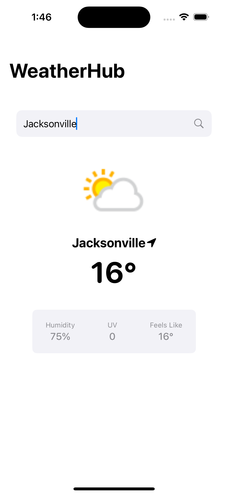

# WeatherHub - iOS Weather Tracker

## Overview
WeatherHub is an iOS app built to track weather for a single saved city. It demonstrates clean architecture, SwiftUI, and API integration. The app allows users to search for a city, view its weather, and persist their selection for seamless access across launches.

## Features
- **Home Screen**:
  - Displays weather for a saved city with details including:
    - City name.
    - Temperature.
    - Weather condition (icon from API).
    - Humidity (%).
    - UV index.
    - "Feels like" temperature.
  - Prompts the user to search for a city if none is saved.

- **Search Bar**:
  - Allows users to search for new cities.
  - Updates the Home Screen and saves the selection.

- **Local Storage**:
  - Uses `UserDefaults` to persist the selected city and reload weather data on app launch.

## Tech Stack
- **Language**: Swift
- **Framework**: SwiftUI
- **Architecture**: MVVM
- **Local Storage**: UserDefaults
- **API**: [WeatherAPI.com](https://www.weatherapi.com/docs/)

## Requirements
- Xcode 14+
- iOS 16.0+

## Screenshots

<!--### Search Screen (With Saved City)
-->

### Home Screen 


<!--### Home Screen (No City)
-->

## Setup Instructions
1. Clone the repository:
   ```bash
   git clone https://github.com/yourusername/weatherhub.git
   cd weatherhub
   ```
2. Install dependencies:
   ```bash
   pod install
   ```
3. Open the project in Xcode:
   ```bash
   open WeatherHub.xcworkspace
   ```
4. Build and run the app on a simulator or device.

## API Integration
WeatherHub integrates with the [WeatherAPI.com](https://www.weatherapi.com/docs/) to fetch real-time weather data. Make sure to configure your API key:
1. Sign up for a free account on [WeatherAPI.com](https://www.weatherapi.com/).
2. Add your API key in the `APIManager.swift` file:
   ```swift
   let apiKey = "YOUR_API_KEY"
   ```

## Future Improvements
- Add support for multiple cities.
- Implement unit and UI tests.
- Improve error handling for edge cases like network errors.

## License
This project is licensed under the MIT License.
